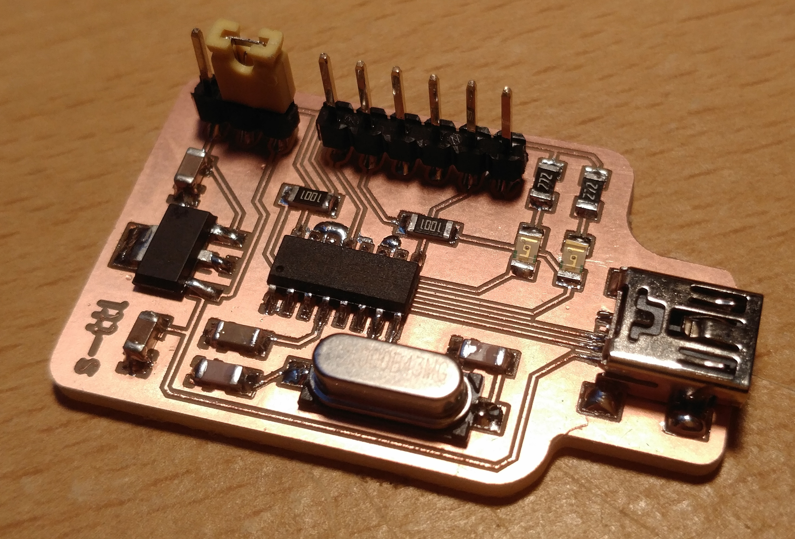
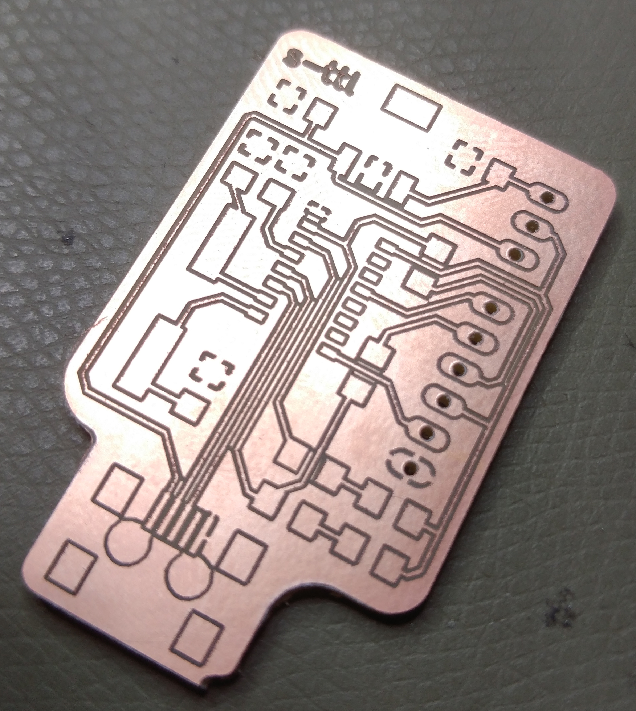
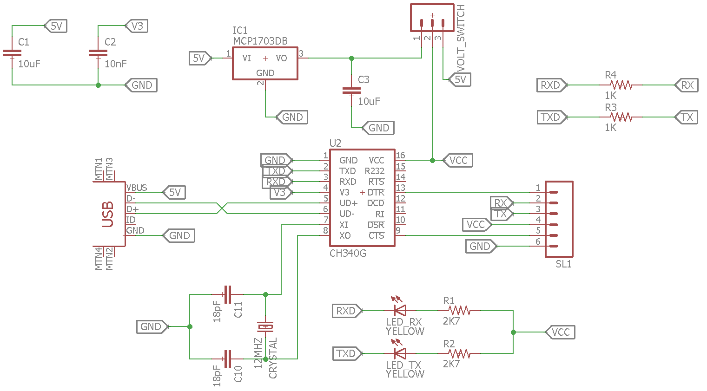
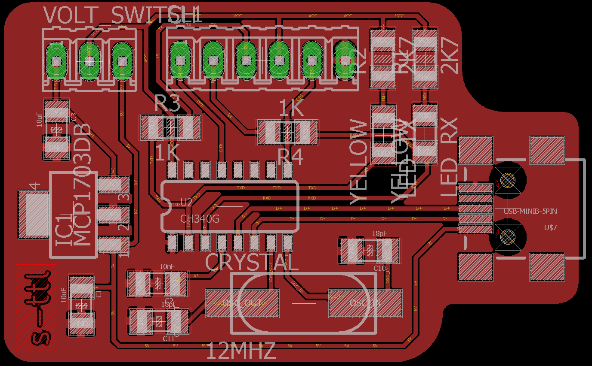
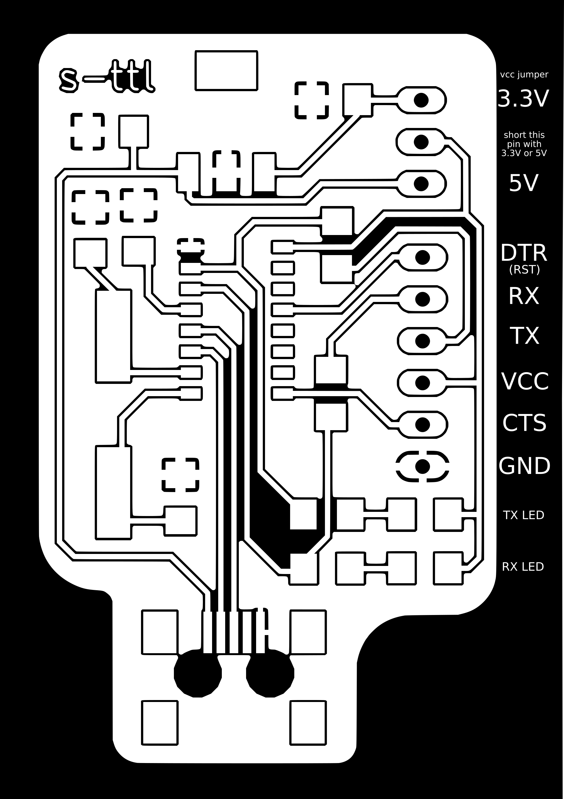
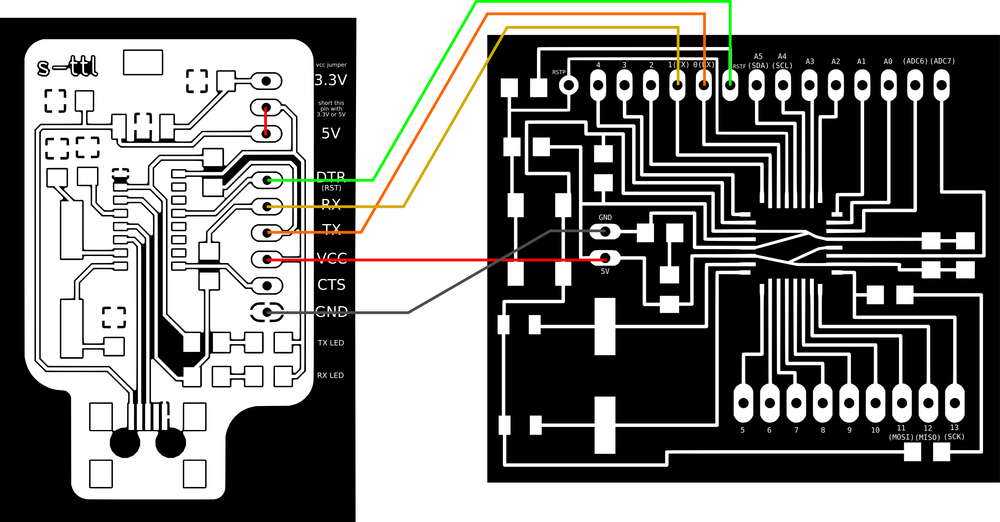
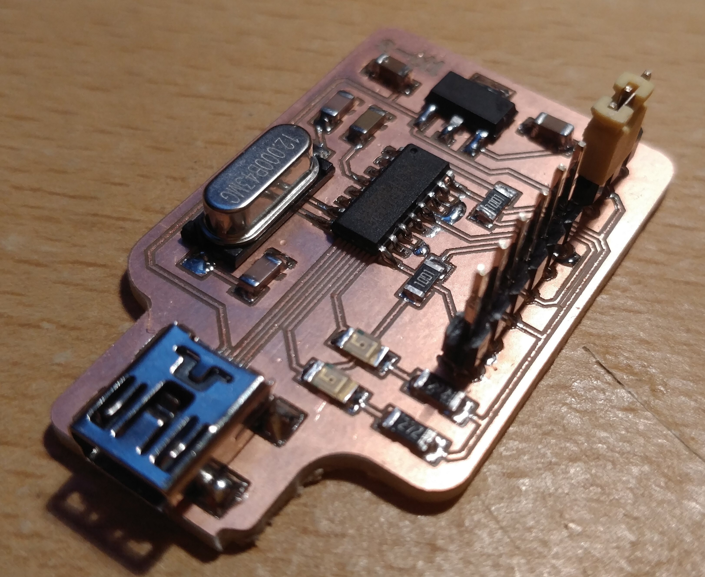
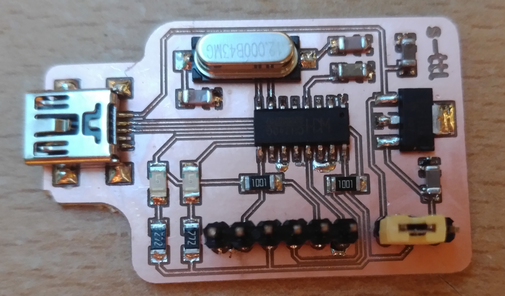
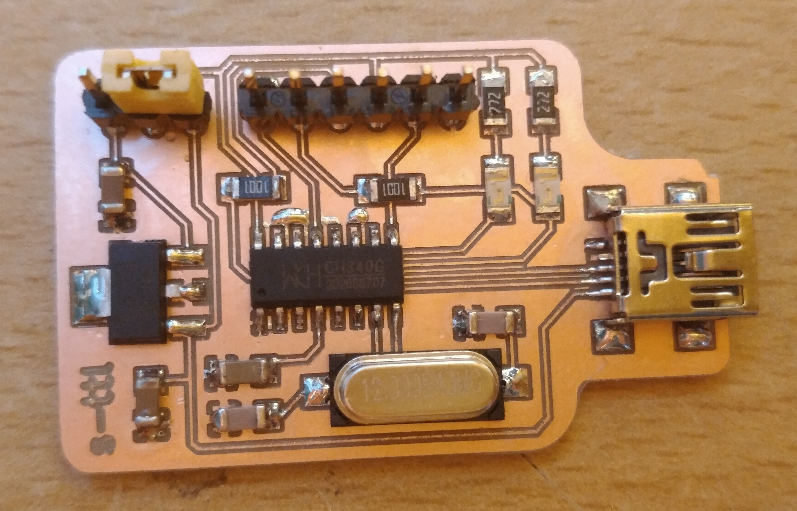
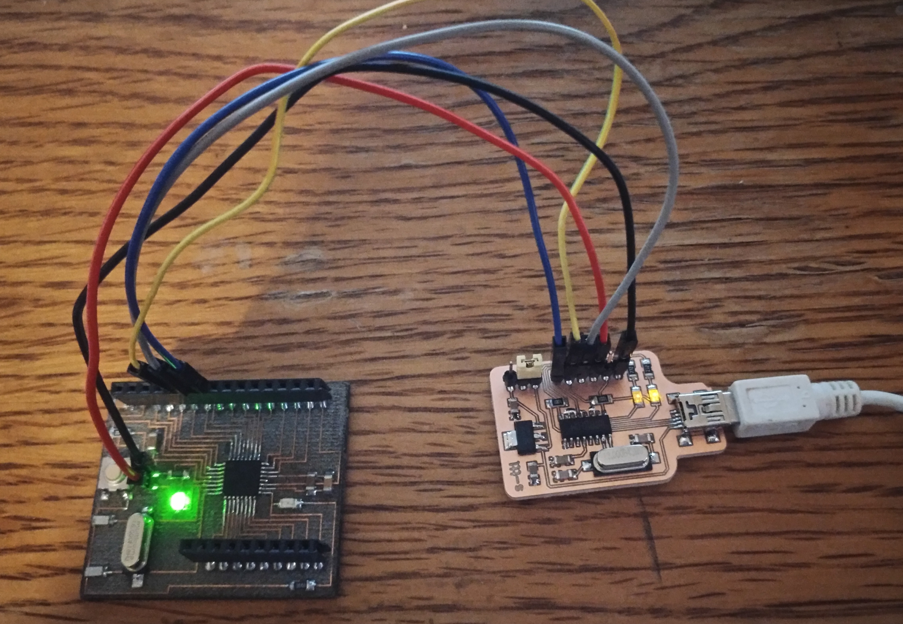

<h1 style="font-family: courier;" align="center">satsha-ttl</h1>

<i>An open source & fabbable USB to serial converter board.</i>

satsha-ttl
--

After some time of buying expensive FDTI cables (about 20$ nowadays) and having the need to use several USB to serial converters for my **[Fab Academy](http://fabacademy.org/)** students, I developed my own fabbable solution. satsha-ttl features a **[CH340G USB to serial chip](https://cdn.sparkfun.com/datasheets/Dev/Arduino/Other/CH340DS1.PDF)** and it is designed to be cheap, reliable and easy to be reproduced. It uses an LDO voltage regulator and a **jumper to switch between 3.3V and 5V**, both for power and logic levels of TX/RX. The design of the satsha-ttl also allows to easily integrate it into existing boards requiring an USB communication without having a dedicated hardware implemented into the microcontroller (eg the 328p).

Here are the **features of the satsha-ttl:**

- **CH340G** USB to serial chip
- selectable voltage of **3.3V and 5V** (both for power and serial)
- **250mA** current on 3.3V
- **USB power** for 5V
- **CTS and DTR** pins
- **mini USB** connector
- **no drivers** needed for latest Windows/MacOS/Linux
- size of **45x28mm**
- cost **1.3€/1.6$** (buying the components from China, **[BOM](https://gitlab.fabcloud.org/satsha/satsha-ttl/raw/master/docs/satsha-ttl-BOM.xlsx)**)

satsha-ttl **PCB**:

satsha-ttl **schematic**:

satsha-ttl **board**:

Downloads
--

**downloads (right click download as):**

- **[satsha-ttl schematic](https://github.com/satsha-utilities/satsha-ttl/raw/master/eagle/satsha-ttl/satsha-ttl.sch)**
- **[satsha-ttl board](https://github.com/satsha-utilities/satsha-ttl/raw/master/eagle/satsha-ttl/satsha-ttl.brd)**
- **[satsha-ttl internal traces png 0.1mm](https://github.com/satsha-utilities/satsha-ttl/raw/master/media/internal.png)**
- **[satsha-ttl cutout png 0.1mm](https://github.com/satsha-utilities/satsha-ttl/raw/master/media/cut.png)**
- **[satsha-ttl internal traces png 0.2mm](https://github.com/satsha-utilities/satsha-ttl/raw/master/media/internal_02.png)**
- **[satsha-ttl cutout png 0.2mm](https://github.com/satsha-utilities/satsha-ttl/raw/master/media/cut_02.png)**
- **[satsha-ttl BOM ods](https://github.com/satsha-utilities/satsha-ttl/raw/master/docs/satsha-ttl-BOM.ods)**
- **[satsha-ttl BOM xlsx](https://github.com/satsha-utilities/satsha-ttl/raw/master/docs/satsha-ttl-BOM.xlsx)**

Getting started with satsha-ttl
--
Before connecting satsha-ttl to your computer is really important to **check if the connections are ok**, as it could damage the USB port of our computer if they are wrong. A smoke test can also be done beforehand with an **USB hub or an USB power supply**.  Install the **drivers** for the CH340G if satsha-ttl is not recognized automatically from your OS. In case you are using Windows 8 or older, or older versions of MacOS/Linux download and install the **[drivers from here](https://sparks.gogo.co.nz/ch340.html)**. 

 Find below the **satsha-ttl pinout**:

satsha-ttl can be used to **supply power** to another microcontroller board, other than connecting the serial. In case of supplying power to another board make sure its voltage and current requirements matches the **selected voltage** on the satsha-ttl jumper and the **maximum current** the satsha-ttl/USB port can output. It is possible to use the satsha-ttl as a **programmer for AVR** microcontrollers with installed the Arduino bootloader, in this case the **DTR** is used **software reset** pin.

Here is an example scheme on how to connect **satsha-ttl to program a satshakit:**

Media
--

satsha-ttl pictures:

satsha-ttl connected with a satshakit:

satsha-ttl 1 million lines gcode test:

satsha-ttl 2 uploading to a satshakit using serial 5V:

satsha-ttl receiving data from software serial 3.3V:

satsha-ttl streaming gcode to grbl satshakit @250000 bauds 5V:

Author
--

- Daniele Ingrassia

Contact
--
- **ingrassiada@gmail.com**
- **[linkedin](http://it.linkedin.com/in/danieleingrassia)**

Thanks
--
[Fablab Kamp-Lintfort](http://fablab.hochschule-rhein-waal.de/index.php/de/) 
Hochschule Rhein-Waal 
Friedrich-Heinrich-Allee 25, 47475 Kamp-Lintfort, Germany 
fablab@hochschule-rhein-waal.de

License
--
This work is licensed under the terms of Attribution-NonCommercial-ShareAlike 4.0 International ([CC BY-NC-SA 4.0](https://creativecommons.org/licenses/by-nc-sa/4.0/)).

Disclaimer  
--

This hardware/software is provided "as is", and you use the hardware/software at your own risk. Under no circumstances shall any author be liable for direct, indirect, special, incidental, or consequential damages resulting from the use, misuse, or inability to use this hardware/software, even if the authors have been advised of the possibility of such damages.

